# 🧮 Time complexity

**Topics Learnt:**  
1. Log arithms
2. Big O Notation
3. Chart of Common Time Complexities
4. How to calculate Big O of a code snippet?
5. Additional Notes
6. Time limit Exceeded (TLE) Error

## 1. What is a Logarithm?

A logarithm is the inverse operation to exponentiation. In simpler terms, a logarithm answers the question: "To what exponent must a specific base be raised to produce a given number?"

For example, consider the logarithm base 2 of 8, denoted as log₂(8). This asks the question: "To what power must 2 be raised to get 8?" Since 2³ = 8, we have log₂(8) = 3.

`
log_b(a) = c  implies  b^c = a
`

Examples:

N = 100 -> N/2 = 50 -> N/4 = 25 -> N/8 = 12.5 -> N/16 = 6.25 -> N/32 = 3.125 -> N/64 = 1.5625 -> N/128 = 0.78125

Here, we divided N by 2 a total of 6 times to get a value less than 1. Thus, log₂(100) is approximately 6.64 (since 2^6.64 ≈ 100).

So we can write it as 
`
N/2^k  = 1
`
Where k is the number of times we divided N by 2.


## 2. What is Big O Notation?

**Big O notation** is a mathematical concept used in computer science to describe the performance or complexity of an algorithm.  
It characterizes algorithms based on how their **time or space requirements** grow as the input size increases.

Big O provides an **upper bound** on growth rate, helping compare algorithm efficiency.

For example:
- An algorithm with **O(n)** grows linearly with input size.
- An algorithm with **O(n²)** grows quadratically with input size.

In essence:
> The lower the Big O value, the more scalable and efficient the algorithm is.

---

## 3. Chart of Common Time Complexities

### 🕒 Order of Growth (from Fastest to Slowest)

| **Order** | **Notation** | **Name** | **Description** |
|------------|---------------|-----------|------------------|
| 1 | **O(1)** | Constant Time | Fastest — execution time is independent of input size. |
| 2 | **O(log n)** | Logarithmic Time | Grows slowly as input size increases. Common in binary search. |
| 3 | **O(n)** | Linear Time | Directly proportional to input size. |
| 4 | **O(n log n)** | Linearithmic Time | Slightly slower than linear — common in efficient sorting algorithms like mergesort and heapsort. |
| 5 | **O(n²)** | Quadratic Time | Common in simple nested loops (e.g., bubble sort). |
| 6 | **O(n³)** | Cubic Time | Common in algorithms with three nested loops. |
| 7 | **O(2ⁿ)** | Exponential Time | Growth doubles with each additional input; typical in recursive brute-force algorithms. |
| 8 | **O(n!)** | Factorial Time | Extremely slow; common in permutation-based problems. |
| 9 | **O(nⁿ)** | Super-Exponential Time | Slowest — infeasible for even small inputs. |

---

### 📈 Visual Comparison

> This chart shows how each time complexity grows as the input size `n` increases.

```mermaid
graph LR
    A["O(1) - Constant"] --> B["O(log n) - Logarithmic"]
    B --> C["O(n) - Linear"]
    C --> D["O(n log n) - Linearithmic"]
    D --> E["O(n^2) - Quadratic"]
    E --> F["O(n^3) - Cubic"]
    F --> G["O(2^n) - Exponential"]
    G --> H["O(n!) - Factorial"]
    H --> I["O(n^n) - Super-Exponential"]

    style A fill:#9ef7b1,stroke:#000,stroke-width:1px
    style B fill:#bdf2d5,stroke:#000,stroke-width:1px
    style C fill:#d7eef9,stroke:#000,stroke-width:1px
    style D fill:#f9f3d7,stroke:#000,stroke-width:1px
    style E fill:#ffd699,stroke:#000,stroke-width:1px
    style F fill:#ffb380,stroke:#000,stroke-width:1px
    style G fill:#ff8c8c,stroke:#000,stroke-width:1px
    style H fill:#ff6b6b,stroke:#000,stroke-width:1px
    style I fill:#ff4d4d,stroke:#000,stroke-width:1px
```



## 4. How to calculate Big O of a code snippet?

**Steps:**

1. **Identify the input size (n):** Determine what variable represents the size of the input data.
2. **Ignore constants and lower-order terms:** Focus on the term that grows the fastest as n increases.
3. **Ignore constant factors:** Multiplicative constants do not affect Big O notation.

For example, consider the following code snippet:

```python
def example_function(arr):
    n = len(arr)
    total = 0
    for i in range(n):
        total += arr[i]
    return total
```
1. The input size is `n`, the length of the array `arr`.
2. The loop runs `n` times, so the time complexity is O(n).
3. There are no constant factors or lower-order terms to consider here.
Thus, the overall time complexity of the function is O(n).

In another example:

```python
def nested_loop(arr):
    n = len(arr)
    for i in range(n):
        for j in range(n):
            print(arr[i], arr[j])
```
1. The input size is `n`, the length of the array `arr`.
2. There are two nested loops, each running `n` times, resulting in `n * n = n²` operations.
3. Ignoring constants and lower-order terms, the time complexity is O(n²).
Thus, the overall time complexity of the function is O(n²).

**Note:** In summary, to calculate the Big O of a code snippet, identify the input size, analyze the loops and operations, and focus on the dominant term that describes how the execution time grows with input size.

---

## 📝 Additional Notes

- **[Big O Cheat Sheet](https://www.bigocheatsheet.com/)**  

---

### 💡 Why Do We Ignore Constants and Lower-Order Terms in Big O Notation?

Big O notation describes the **asymptotic behavior** of an algorithm — that is, how it performs as the input size (`n`) approaches infinity.  
In this context, **constant factors** and **lower-order terms** become negligible compared to the **dominant term** (the one that grows the fastest).

This simplification helps us:
- Focus on the **most significant factor** affecting performance.
- **Compare algorithms** more easily at scale.
- Avoid cluttering the analysis with minor differences that don’t matter for large inputs.

---

### Example

Consider two algorithms:

- **Algorithm A:** O(2n + 3)  
- **Algorithm B:** O(n)

As `n` becomes very large, the term `2n` dominates the constant `3` in Algorithm A.  
Thus, both can be simplified to **O(n)** for large input sizes.

> Therefore, when analyzing algorithms, we focus only on the term that grows the fastest as `n → ∞`, since it determines the long-term performance trend.

---

#### Issues in Big O Analysis

1. **Best, Worst, and Average Cases:** Big O notation typically describes the worst-case scenario. However, it's also important to consider best-case and average-case complexities, as they can provide a more complete picture of an algorithm's performance.

2. **Space Complexity:** While Big O notation is often used to describe time complexity, it can also be applied to space complexity, which measures the amount of memory an algorithm uses relative to the input size.

3. **Non-Uniform Input:** Big O analysis assumes uniform input sizes. In practice, input data can vary significantly, affecting performance in ways that are not captured by a single Big O expression.

4. **Hidden Constants:** While we ignore constant factors in Big O notation, they can still have a significant impact on performance for small input sizes. This is why it's important to consider empirical performance measurements alongside theoretical analysis.

5. **Implementation Details:** The specific implementation of an algorithm can affect its performance characteristics. Factors such as programming language, compiler optimizations, and hardware can all influence the actual running time of an algorithm.

### Example: Calculating Big O for a More Complex Code Snippet

```python
def complex_function(arr):
    n = len(arr)
    total = 0
    for i in range(n):
        for j in range(n):
            total += arr[i] * arr[j]
    for k in range(100):
        print("This is a constant time operation")
    return total
```
1. The input size is `n`, the length of the array `arr`.
2. The first part has two nested loops, each running `n` times, resulting in `n * n = n²` operations.
3. The second part runs a constant number of times (100), which is O(1).
4. Ignoring constants and lower-order terms, the overall time complexity is dominated by the O(n²) term.
Thus, the overall time complexity of the function is O(n²).

## 5. Time limit Exceeded (TLE) Error
A Time Limit Exceeded (TLE) error occurs when a program takes longer to execute than the time limit set by the online judge or testing environment. This usually indicates that the algorithm used is not efficient enough for the given input size.

### Common Causes of TLE:
1. **Inefficient Algorithms:** Using algorithms with high time complexity (e.g., O(n²), O(2ⁿ)) for large input sizes.
2. **Unnecessary Computations:** Performing redundant calculations within loops.
3. **Large Input Sizes:** Not optimizing the algorithm to handle the maximum input constraints.


**Note:** All the online editors have 1GHz of memory and a time limit 10 power 9 instructions (1 second) for each test case. So while solving problems we need to make sure that our code runs within this limit.

The code we write should have 10 power 8 instructions or less to be on the safer side and make sure it runs within 1 second for each test case.
